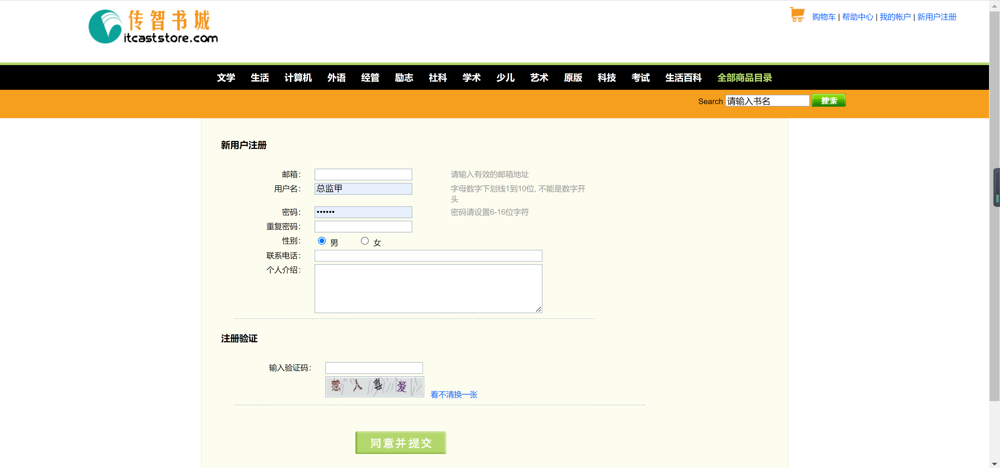
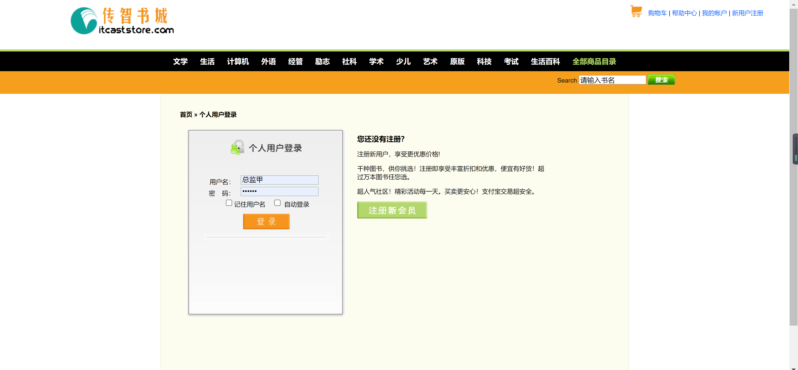
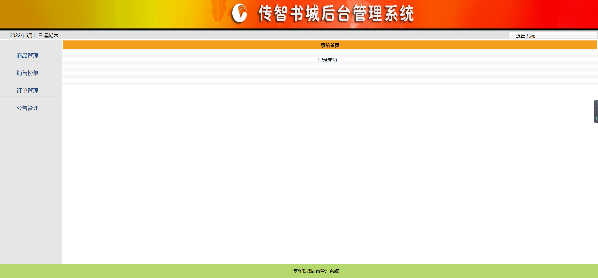
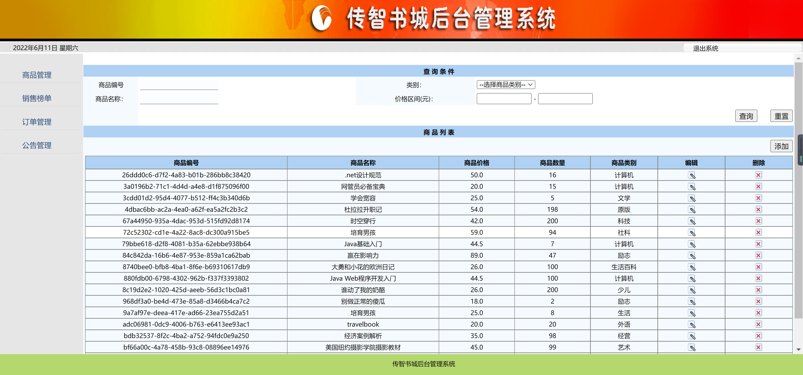
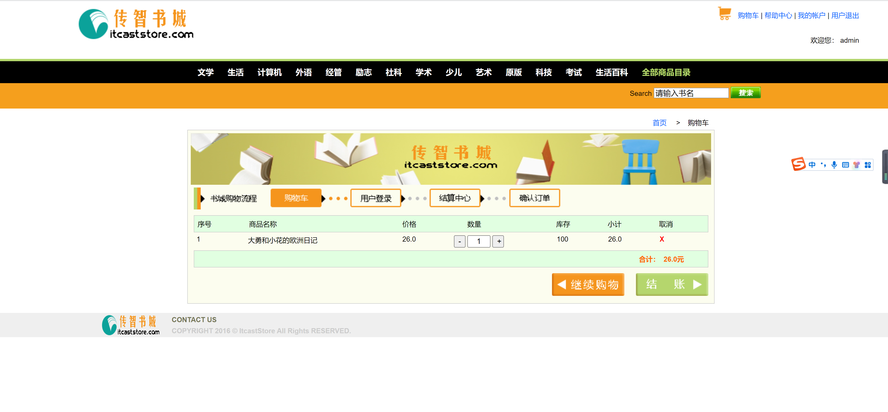
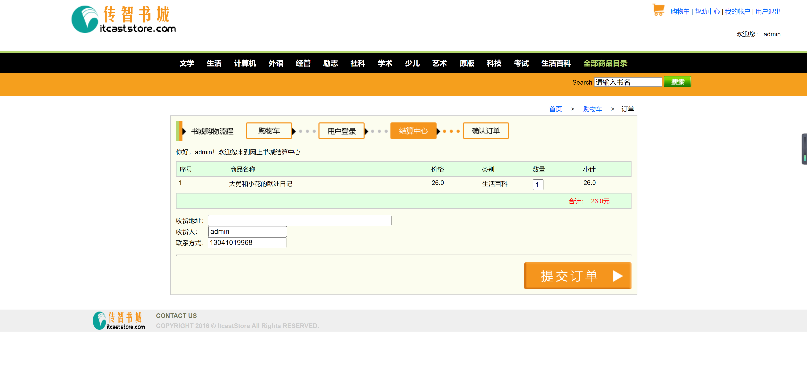

<h1 align="center">传智书城管理系统</h1>

## 简介
传智书城管理系统：角色分为管理员、用户；功能包括商品管理、购物车、订单结算、用户注册和登录。系统简洁高效，提升用户购物体验。    --计算机毕业设计源码；毕设源码；java毕业设计源码

## 联系方式

<h3 align="center">获取完整代码与数据库文件 + 微信：deepguan QQ: 86050149 QQ群: 783742310</h3>

<h3 align="center">可帮忙远程部署 包运行成功！提供远程部署、修改代码、设计文档指导、代码讲解等服务！</h3>

## 功能介绍（完整见运行截图）
管理员：管理界面包括商品添加、编辑、删除、销售数据查看、订单管理及公告发布功能。具备快速搜索商品的条件输入框，支持按商品编号、名称、类别及价格区间搜索。用户登录后即可通过侧边栏进入各管理模块，顶部有退出系统的按钮以控制系统访问。

用户：用户能在首页通过导航栏按类别浏览书籍、查看促销信息及本周热卖书籍，保证购物流畅。购物流程从加入购物车到选择数量、核对总价，再到结算的整体过程，经用户填入收货信息并确认购买。登录功能包括记住用户名及自动登录选项，并提供新用户注册入口。注册时需填写个人信息与验证安全性，还有帮助中心和账户管理的服务入口。

## 运行截图

本代码来源于网络,仅供学习参考使用!

